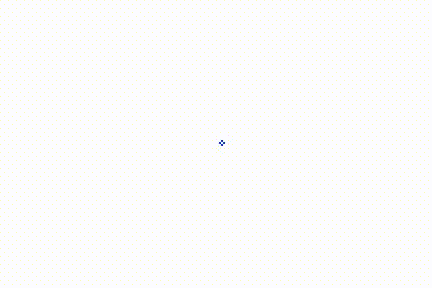

# # 2D model plazov

## Namestitev okolja

V okolju windoes je potrebno namestiti virtualno okolje in nato aktivirati le tega. To storimo z naslednjimi ukazi:
```Bash
python -m venv venv
./venv/Scripts/activate
```

Nato namestimo potrebne knjižnice:
```Bash

pip install -r requirements.txt
```

## Opis problema



**Reference:** 
[1] http://guava.physics.uiuc.edu/~nigel/courses/563/Essays_2012/PDF/banerjee.pdf <br>
[2] http://blairgemmer.com/docs/BakTang/SandpileWriteup.pdf <br>
[3] https://www.youtube.com/watch?v=1MtEUErz7Gg <br>

Izdelali bomo model peščenih plazov v dveh dimenzijah. V ta namen ustvarimo $N \times N$ naklonsko matriko naravnih števil $(\bold{S})$. Glede na vrednost, ki jo $ij$-ti element te matrike zavzema, opredelimo $S[i,j]$ kot:
 - stabilen, kadara je strmina $S[i,j]<4$ 
 - nestabilen, kadar je strmina $S[i,j]\geq 4$


Na začetku lahko elementi matrike zavzemajo vrednost 0 ali pa njihovo vrednost določimo naključno.

Nato pričnemo dodajati zrna peska. Če določena celica postane nestabilna uporabimo naslednjo pravilo: 1) s[i,j]=s[i,j]-4 (celici odvzamemo 4 zrna peska in jih porazdelimo med sosednjimi štirimi celicami) s[i+1,j]=s[i+1,j]+1 s[i-1,j]=s[i-,j]+1 s[i,j+1]=s[i,j+1]+1 s[i,j-1]=s[i,j-1]+1.

Ko en element matrike postane nestabilen, uporabimo pravilo (1) in usklajeno z drugimi celicami spremljamo kako velik plaz se sproži (število elementov, ki zaradi pravila (1) posatane nestabilno).

## Uporaba kode

Preden zaženemo kodo, je potrebno aktivirati virtualno okolje in imeti nameščene potrebne knjižnice.

Za zagon kode uporabimo ukaz:
```Bash
python main.py
```